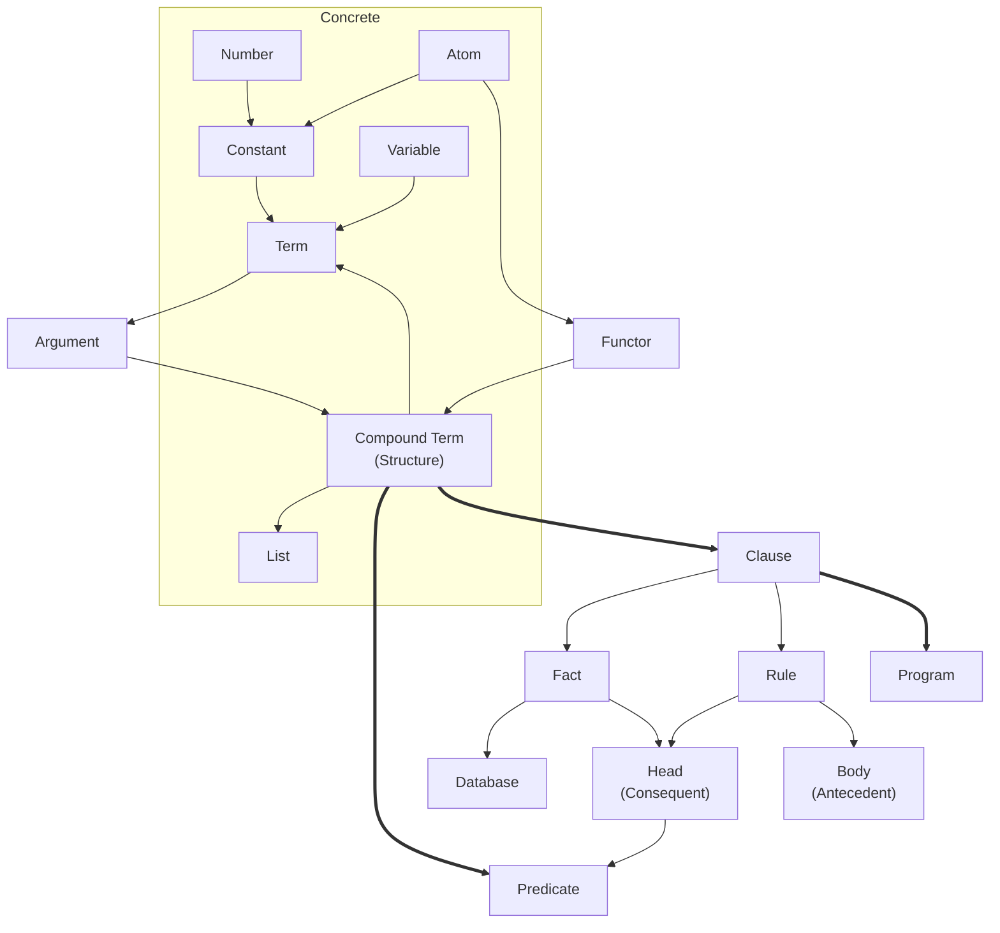
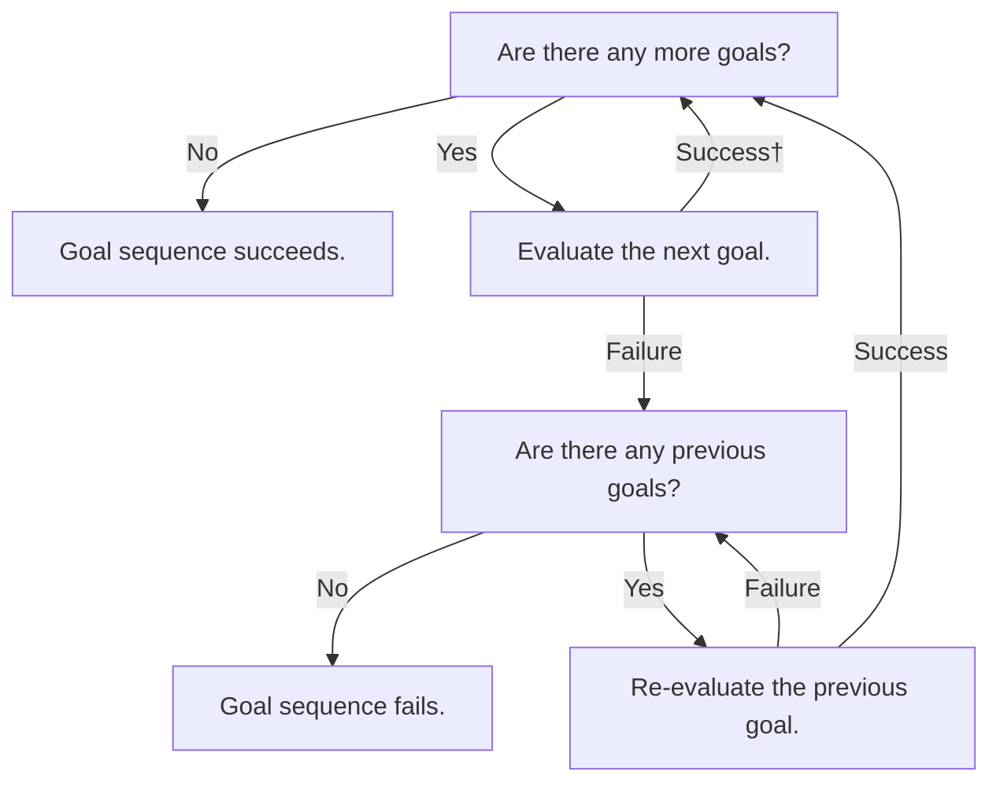
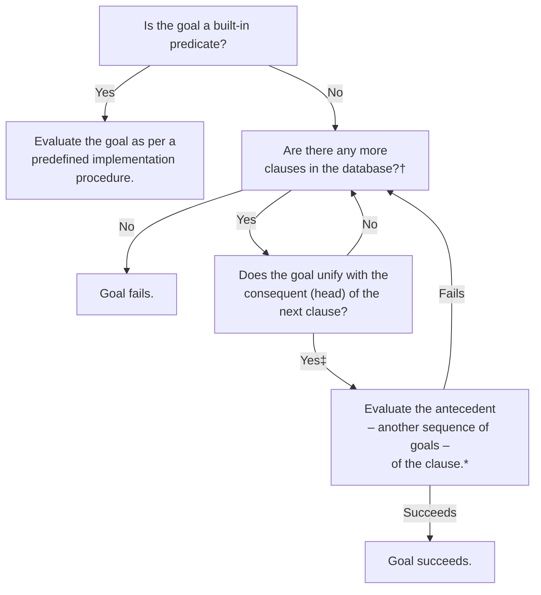

# Iprollogical

This is basically collection of notes and practice programs concerning logic and answer-set programming paradigms. It will continue to grow and change shape as we learn more.

- [Iprollogical](#iprollogical)
  - [Data Types, Concepts \& Vernacular](#data-types-concepts--vernacular)
  - [Prolog Evaluation Procedures (Unification \& Backtracking)](#prolog-evaluation-procedures-unification--backtracking)
    - [Evaluating a Sequence of Goals](#evaluating-a-sequence-of-goals)
    - [Evaluating \& Re-evaluating a Goal](#evaluating--re-evaluating-a-goal)
  - [Operators \& Built-in Predicates](#operators--built-in-predicates)
    - [Associativity Notation](#associativity-notation)
    - [Arithmetic Operators](#arithmetic-operators)
    - [Arithmetic Predicates](#arithmetic-predicates)
    - [Logical Operations](#logical-operations)
    - [List Processing](#list-processing)


## Data Types, Concepts & Vernacular

Prolog **programs** comprise a collection of **clauses**. Clauses are terminated by a dot and at least one whitespace character. They are either facts or rules:
- **Rules** are of the form `head :- body.` or `consequent :- andecedent.` where `:-` is called the *neck operator*. Rules can be read declaratively as "the `head` holds if the `body` holds" or procedurally as "to satisfy the `head`, first satisfy the `body`." The former is usually more idiomatic.
- **Facts** take the form `head.` or `consequent.` and are equivalent to a rule whose antecedent always holds, i.e. `fact :- true`. A collection of facts is called a **database**.

**Terms** are the sole data structure in Prolog; everything is achieved through composition of terms, which provide the concrete basis for more theoretical mechanisms. These are generally described using their own less concrete, more logical or mathematical nomenclature (which I have attempted to depict below). Terms may be **constants** – which comprise real numbers and **atoms**, or named constants – or **compound terms**, which are also called **structures**.

Compound terms are of the form `$functor(x₁, ..., xₙ)` where the **functor** is an atom, `x₁, ..., xₙ` represent **arguments** (which can be any valid terms) and `n` is the `arity` of the structure. The outermost functor of a compound term is called the **principle functor**. Compound terms are used to define **predicates**; in particular, any clause whose head is a compound term is said to define a predicate. The **mode** of an argument refers to whether or not it should be instantiated as part of a goal: `+` means it should be instantiated, `-` the opposite, and `?` either. The mode should always be annotated.



## Lists

TODO

## Operators

An **operator** is a specialised notation using functors binary and unary predicates: they use infix notation – `X ~ Y` – in the first case, and prefix – `~X` – or postfix – `X~` – notation in the latter. They are converted back into compound terms by the interpreter, i.e. `X * Y + Z` would become `+(*(X, Y), Z)`. This process is governed by the operator's **priority**, which indicates how tightly bound an operator is to its arguments, and **associativity**. Terms can be left or right associative, and may also prohibit association. Their priority is an integer value from 1 to 1200 (directly correlated with priority) that supports the recursive derivation of the princple functor in an expression, i.e. the ordering of each operator in an expression in descending order of precedence, where the operator of lowest precedence becomes the principle functor. Operators are defined by name, priority, and **specifier**, which encodes its associativity and type of notation.

```prolog
% Respectively, left-associative and right-associative operators.
(X * A) * B.
X ^ (A ^ B).

% Directive used to define an operator.
:- op(+Priority, +Specifier, +Name).

% Query the definition of an existing operator.
?- current_op(?Priority, ?Specifier, ?:Name).
```

### Specifiers

For all specifiers, `f` represents the operator, `x` represents an argument with strictly lower precedence than the operator, and `y` an argument with strictly more precedence.

| Operator | Nonassociative | Right-associative | Left-associative |
|----------|----------------|-------------------|------------------|
| Infix    |`xfx`           |`xfy`              |`yfx`             |
| Prefix   |`fx`            |`fy`               |                  |
| Postfix  |`xf`            |                   |`yf`              |

## Prolog Evaluation Procedures: Unification & Backtracking

Charts that visualise the precedural flow of a Prolog program. Based on Figures 3.5 and 3.6 in the second edition of Bramer's *Logic Programming with Prolog* (2013). Given the processes outlined below, it stands to reason that both the order in which the clauses concerning a certain predicate and the order of goals in the antecedent of a rule occur exercise significant influence on the evaluation of any given query; a truly **declarative** program should do what it can to mitigate the effect of these circumstances, refraining from relying on them to communicate the semantics or influence the execution process for any instance of that program.

### Evaluating a Sequence of Goals


† Some variables may have been instantiated (or bound) as part of this step.<br>
‡ Some variables may be reinstantiated – uninstantiated (or unbound) and reinstantiated to a new term – here.

### Evaluating & Re-evaluating a Goal


† First evaluation begins at the top of the database; re-evaluation begins after the clause that last satisfied the goal.<br>
‡ Some variables may have been instantiated (or bound) as part of this step.<br>
\* Clause succeeds immediately if it is a fact (a rule where the antecedent is always true).

## Error-Handling

The built-in `catch(+Goal, ?Catcher, ?Recover)` predicate executes `Goal`, and if an error that unifies with `Catcher` is raised, proceeds to `Recover` and continues execution. Built-in predicates use `throw(+Exception)` to raise an exceptions, which returns to the invoking `catch/3` predicate. If no catch exists, execution halts and control is transferred to the user. Catchers of built in predicates are of the form `error(ErrorTerm, Information)`, where `ErrorTerm` is a description of the error, and `Information` is implementation-dependent.

```prolog
?- catch((X is 1 + Y), Error, (write(Error), nl, fail)). % Recover writes error to standard output and fails.
   error(instantiation_error, context(system: (is)/2, _GXyz))
   false.

% Usage of the throw/1 predicate.
panic :- throw(error('Panicking', context)). % TODO: Clarify the Information argument further.
```

## Built-in Operators and Predicates

Built-in predicates provide functionality defined by the system or implementation, and should not be redefined.

### Arithmetic Operators

| Operator | Operation             |
|----------|-----------------------|
|`+`       | Addition              |
|`-`       | Subtraction           |
|`*`       | Multiplication        |
|`^`       | Exponentiation        |
|`/`       | Division              |
|`//`      | Integer division      |
|`mod`     | Modulo                |
|`is`      | Arithmetic evaluation |

- Note: `is` is a binary operator operator used to evaluate arithmetic expressions as per `?- Value is Expression`, where if the first argument `Value` is an uninstantiated variable, it is instantiated with the numerical value evaluated from the second argument `Expression`. Otherwise, if the `Value` is already instantiated, `is` only succeeds if the numerical values are the same. More precisely, the second argument is evaluated numerically and *unified* with the first argument.

### Arithmetic Predicates

| Predicate | Operation             |
|-----------|-----------------------|
|`abs\1`    | Absolute value        |
|`sin\1`    | Sine                  |
|`cos\1`    | Cosine                |
|`min\2`    | Minimum               |
|`max\2`    | Maximum               |
|`round\1`  | Round                 |
|`sqrt\1`   | Square root           |

### Comparison Operators

Comparison operators are distinct for arithmetic and literal expressions. Both arguments in arithmetic expressions are always evaluated before comparison. Literal arguments are compared with respect to their lexical order.

| Operation             | Arithmetic comparison | Literal comparison |
|-----------------------|-----------------------|--------------------|
| Equality              | `=:=`                 |`==`
| Inequality            | `=/=`                 |`\==`
| Less than             | `<`                   |`@<`
| Less than or equal    | `=<`                  |`@<=`
| Greater than          | `>`                   |`@>`
| Greater than or equal | `>=`                  |`@>=`

### Logical Operators

| Operation     | Arithmetic            |
|---------------|-----------------------|
|`not` or `\+`  | Negation              |
|`,`            | Conjunction           |
|`;`            | Disjunction           |

- Note: `;` is the infix disjunction operator – as per the predicate `;/2` – which represents the logical or. This can convolute the logical or semantic intention of any given clause, especially contrasted against the equivalent clause making exclusive use of conjunction. Consensus seems to be that it's best to heavily preference the use of conjunction.

### List Operation Predicates

See `01-Anaxandridas.pl` for some sample implementations of these predicates, and also the [SWI Prolog List Manipulation Documentation](https://www.swi-prolog.org/pldoc/man?section=lists). TOOD: open to the expansion of this table in future; consolidating documentation.

| Predicate       | Functionality         |
|-----------------|-----------------------|
|`member/2`       | Membership            |
|`append/3`       | Concatenation         |
|`delete/3`       | Deletion              |
|`intersection/3` | Intersection          |
|`reverse/2`      | Reversal              |
|`length/2`       | Length                |
|`quicksort/2`    | Sort                  |

### Other Built-in Predicates

#### Type Predicates

| Predicate       | Functionality         |
|-----------------|-----------------------|
|`number/1`       | Is the argument a number?
|`integer/1`      | An integer?
|`float/1`        | A floating-point value?
|`atom/1`         | An atom?
|`atomic/1`       | An atomic value; a number or an atom?
|`var/1`          | A variable?
|`nonvar/1`       | Anything other than a variable?
|`compound/1`     | A compound term?
|`ground/1`       | A ground term; all variables instantiated.

#### Term Manipulation Predicates & Operators

| Predicate       | Usage                                                                  | Functionality |
|-----------------|------------------------------------------------------------------------|---------------|
|`functor/3`|`functor(+Term, ?Functor, ?Arity)` or `functor(-Term, +Functor, +Arity)`| Get the principle functor and arity of a term, or the most general term given its princple functor and arity.
|`arg/3`|`arg(+N, +Term, ?X)`| Unifies `X` with the argument of rank `N` in `Term`.
|`=../2`|`+Term =.. ?List` or `-Term =.. +List`|*Univ* predicate; transforms a term into a corresponding list.
|`name/2`|`name(?Atom, ?List)`|Converts an atom into a list of corresponding ASCII codes.

## Dynamically Accessing & Updating the Database

Since compilation occurs before runtime, **dynamic** predicates – those which can be altered at runtime – must be declared as such; predicates are **static** by default. Static predicates are compiled, where dynamic predicates are executed using an interpreter. Dynamic predicates can be declared using the `dynamic/1` directive, or by being declared exclusively during runtime. The directive should be used before any clauses defining the given predicate. Attempting to modify a static predicate will raise an error. Itermediate results should never be asserted; modifications to the database should only reflect a permanent change in the program's state.

The `dynamic/1` directive states that a predicate exists, even if no clauses yet exist to define it. If this happens for a static predicate, an error will be raised; in the former case, however, queries will just fail silently. This is typically undesirable, so either the `:- unknown(-OldValue, +NewValue)` directive or `set_prolog_flag(+FlagName, +NewValue)` can be used to alter this behaviour. Each of these arguments can be one of three values, which behave as follows:

- `warning` – evaluating an unknown predicate issues a warning and fails.
- `error` – raises an error; default value.
- `fail` – fails silently.

```prolog
:- unknown(X, warning).

% Setting a flag as follows has the same effect.
:- set_prolog_flag(unknown, warning).

% Retrieving current flag status.
?- current_prolog_flag(+FlagName, ?Value).
```

| Predicate | Usage | Functionality |
|-----------|-------|---------------|
|`clause/2` |`clause(+Head, ?Body)`| Returns the body of a clause where the head unifies with `Head`.
|`asserta/1`|`asserta(+P)`| Adds clause `P` to the database. Inserted before other clauses of the given predicate.
|`assertz/1`|`assertz(+P)`| As above, but inserted after other clauses.
|`retract/1`|`retract(+P)`| Removes clause `P` of a dynamic predicate from the database.
|`abolish/1`|`abolish(+Predicate/Arity)`| Removes all clauses of dynamic predicate `Predicate` with arity `Arity` from the database.

### Lemmas, or Memo Functions

TODO

```prolog
% General form of the lemma. Cut prevents backtracking. Avoid asserting rules in general.
lemma(P) :- P, asserta((P :- !)).
```
