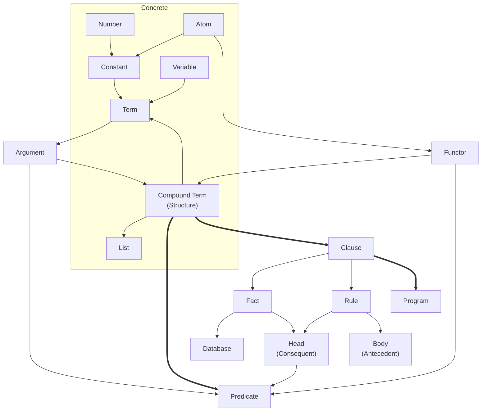
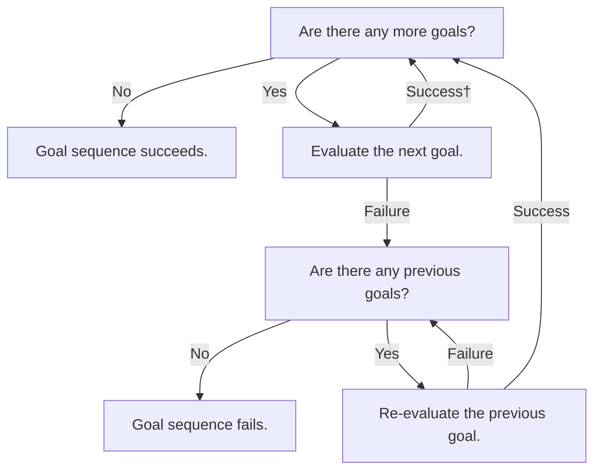
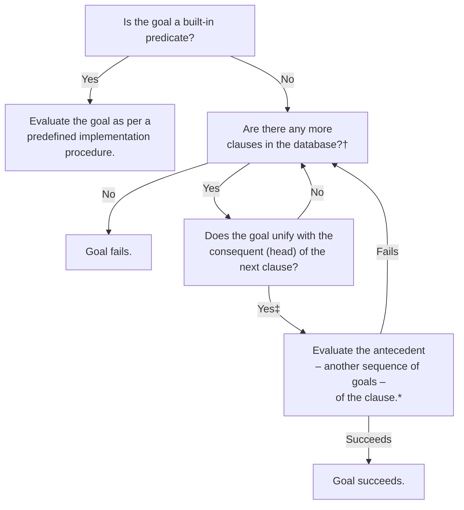

# Iprollogical

A collection of notes concerning and exercises reflecting my understanding of logic and answer-set programming paradigms, started as part of my course in Intelligent Decision Making. My intention is to continue expanding this knowledge base in accordance with to the benefit of my own.

- [Iprollogical](#iprollogical)
  - [Concepts \& Vernacular](#concepts--vernacular)
  - [Prolog Evaluation Procedures (Unification \& Backtracking)](#prolog-evaluation-procedures-unification--backtracking)
    - [Evaluating a Sequence of Goals](#evaluating-a-sequence-of-goals)
    - [Evaluating \& Re-evaluating a Goal](#evaluating--re-evaluating-a-goal)
  - [Operators \& Built-in Predicates](#operators--built-in-predicates)
    - [Associativity Notation](#associativity-notation)
    - [Arithmetic Operators](#arithmetic-operators)
    - [Arithmetic Predicates](#arithmetic-predicates)
    - [Logical Operations](#logical-operations)
    - [List Processing](#list-processing)

## Concepts & Vernacular

Prolog **programs** comprise a collection of **clauses**. Clauses are terminated by a dot and at least one whitespace character. They are either facts or rules:
- **Rules** are of the form `head :- body.` or `consequent :- andecedent.` where `:-` is called the *neck operator*. Rules can be read declaratively as "the `head` holds if the `body` holds" or procedurally as "to satisfy the `head`, first satisfy the `body`." The former is usually more idiomatic.
- **Facts** take the form `head.` or `consequent.` and are equivalent to a rule whose antecedent always holds, i.e. `fact :- true`. A collection of facts is called a **database**.

**Terms** are the sole data structure in Prolog; everything is achieved through composition of terms, which provide the concrete basis for more theoretical mechanisms. These are generally described using their own less concrete, more logical or mathematical nomenclature (which I have attempted to depict below). Terms may be **constants** – which comprise real numbers and **atoms**, or named constants – or **compound terms**, which are also called **structures**.

Compound terms are of the form `$functor(x₁, ..., xₙ)` where the **functor** is an atom, `x₁, ..., xₙ` represent **arguments** (which can be any valid terms) and `n` is the `arity` of the structure. Compound terms are used to define **predicates**; in particular, any clause whose head is a compound term is said to define a predicate.

## Prolog Evaluation Procedures (Unification & Backtracking)

Charts that visualise the precedural flow of a Prolog program. Based on Figures 3.5 and 3.6 in the second edition of Bramer's *Logic Programming with Prolog* (2013). Given the processes outlined below, it stands to reason that both the order in which the clauses concerning a certain predicate and the order of goals in the antecedent of a rule occur exercise significant influence on the evaluation of any given query; a truly **declarative** program should do what it can to mitigate the effect of these circumstances, refraining from relying on them to communicate the semantics or influence the execution process for any instance of that program.

### Evaluating a Sequence of Goals

† Some variables may have been instantiated (or bound) as part of this step. 
‡ Some variables may be reinstantiated – uninstantiated (or unbound) and reinstantiated to a new term – here.

### Evaluating & Re-evaluating a Goal

† First evaluation begins at the top of the database; re-evaluation begins after the clause that last satisfied the goal. 
‡ Some variables may have been instantiated (or bound) as part of this step. 
\* Clause succeeds immediately if it is a fact (a rule where the antecedent is always true).

## Operators & Built-in Predicates

### Associativity Notation

- TODO: `xfx`, `xfy`, `yfx`, etc.
- `x` is an argument with strictly less precedence than the operator itself.
- `y` is as per the above, with strictly more precedence.

### Arithmetic Operators

| Operator | Operation             |
|----------|-----------------------|
|`+`       | Addition              |
|`-`       | Subtraction           |
|`*`       | Multiplication        |
|`^`       | Exponentiation        |
|`/`       | Division              |
|`//`      | Integer division      |
|`mod`     | Modulo                |
|`is`      | Arithmetic evaluation |

- Note: `is` is a binary operator, where if the first argument (on the left) is an uninstantiated variable, it is instantiated with the numerical value evaluated from the second argument (on the right). Otherwise, if the first argument is already instantiated, `is` only succeeds if the numerical values are the same. More precisely, the second argument is evaluated numerically and *unified* with the first argument.

### Arithmetic Predicates

| Predicate | Operation             |
|-----------|-----------------------|
|`abs\1`    | Absolute value        |
|`sin\1`    | Sine                  |
|`cos\1`    | Cosine                |
|`min\2`    | Minimum               |
|`max\2`    | Maximum               |
|`round\1`  | Round                 |
|`sqrt\1`   | Square root           |

### Logical Operations

| Operator     | Operation             |
|--------------|-----------------------|
|`not` or `\+` | Negation              |
|`,`           | Conjunction           |
|`;`           | Disjunction           |

- Note: `;` is the infix disjunction operator – as per the predicate `;/2` – which represents the logical or. This can convolute the logical or semantic intention of any given clause, especially contrasted against the equivalent clause making exclusive use of conjunction. Consensus seems to be that it's best  to heavily preference the use of conjunction.

### List Processing

- `append/3` should probably be called `concatenated` or something similar; behaves like `concatenated(PrefixList, SuffixList, ConcatenatedList)`.