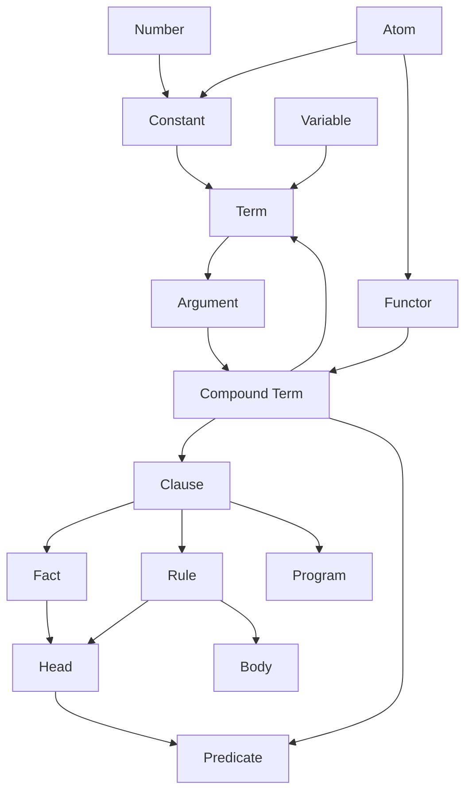
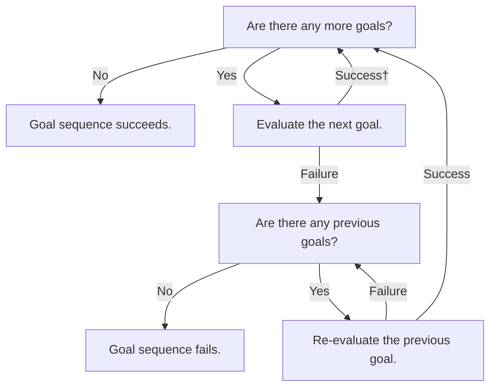
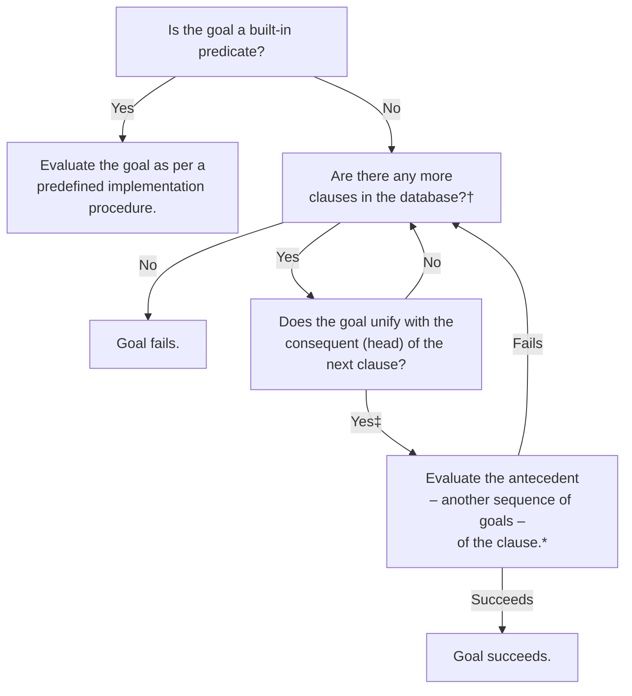

# Iprollogical

A collection of notes concerning and exercises reflecting my understanding of logic and answer-set programming paradigms, started as part of my course in Intelligent Decision Making. My intention is to continue expanding this knowledge base in accordance with to the benefit of my own. TODO: This document (and probably the whole repository) will probably need to be decomposed once the content has expanded a bit.

- [Iprollogical](#iprollogical)
  - [Prolog Evaluation Procedures (Unification \& Backtracking)](#prolog-evaluation-procedures-unification--backtracking)
    - [Evaluating a Sequence of Goals](#evaluating-a-sequence-of-goals)
    - [Evaluating \& Re-evaluating a Goal](#evaluating--re-evaluating-a-goal)
  - [Operators: Notation \& Definition](#operators-notation--definition)
    - [Associativity Notation](#associativity-notation)
  - [Useful Built-in Predicates \& Operators (SWI Prolog)](#useful-built-in-predicates--operators-swi-prolog)
    - [Arithmetic Operators](#arithmetic-operators)
    - [Arithmetic Predicates](#arithmetic-predicates)
    - [Logical Operators](#logical-operators)
    - [List Processing](#list-processing)

## Concepts & Vernacular

Prolog programs comprise a collection of clauses. Clauses are terminated by a dot character, followed by at least one whitespace character. Clauses are either facts or rules:
- Rules are of the form `head :- body.` or `consequent :- andecedent.` where `:-` is called the neck operator. Rules can be read declaratively as "the `consequent` holds if the `body` holds" or procedurally as "to satisfy the `consequent`, first satisfy the `antecedent`." The former is usually more idiomatic.
- Facts take the form `head.` or `consequent.` and are equivalent to a rule whose antecedent always holds, i.e. `fact :- true.`

The term is the sole data structure in Prolog; everything else is achieved through composition of terms, which thus provide the concrete basis for more theoretical mechanisms. These are generally described using their own less concrete, more logical or mathematical nomenclature. TODO: Colour the nodes of this chart to categorise conrete data structure terms, and more abstract logical terms.

## Prolog Evaluation Procedures (Unification & Backtracking)

Charts that visualise the precedural flow of a Prolog program. Based on Figures 3.5 and 3.6 in the second edition of Bramer's *Logic Programming with Prolog* (2013). Given the processes outlined below, it stands to reason that both the order in which the clauses concerning a certain predicate and the order of goals in the antecedent of a rule occur exercise significant influence on the evaluation of any given query; a truly **declarative** program should do what it can to mitigate the effect of these circumstances, refraining from relying on them to communicate the semantics or influence the execution process for any instance of that program.

### Evaluating a Sequence of Goals

† Some variables may have been instantiated (or bound) as part of this step. 
‡ Some variables may be reinstantiated – uninstantiated (or unbound) and reinstantiated to a new term – here.

### Evaluating & Re-evaluating a Goal

† First evaluation begins at the top of the database; re-evaluation begins after the clause that last satisfied the goal. 
‡ Some variables may have been instantiated (or bound) as part of this step. 
\* Clause succeeds immediately if it is a fact (a rule where the antecedent is always true).

## Operators: Notation & Definition

### Associativity Notation

- TODO: `xfx`, `xfy`, `yfx`, etc.
- `x` is an argument with strictly less precedence than the operator itself.
- `y` is as per the above, with strictly more precedence.

## Useful Built-in Predicates & Operators (SWI Prolog)

### Arithmetic Operators

- `+`
- `-`
- `*`
- `/`
- `//` — Integer arithmetic div and mod operators.
- `mod`
- `^`
- `is` — Binary operator, if the left is and uninstantiated variable, it is instantiated with the numerical value on the right. If it's an instantiated numerical value, `is` succeeds if the two values are the same, and fails otherwise. More precisely, the second argument is evaluated numerically and *unified* with the first argument.

### Arithmetic Predicates

- `abs/1`
- `sin/1`
- `cos/1`
- `max/2`
- `round/1`
- `sqrt/1`

### Logical Operators

- `not` — Sometimes implemented as an operator, sometimes left as predicate `not/1`. Can convert using `:- op(1000, fy, not).`
- `;` — Infix disjunction operator, as per the predicate `;/2`; represents the logical or. This can convolute the logical or semantic intention of an antecedent its included in, especially contrasted agains the equivalent clause using conjunction (the `,/2` predicate that represents the logical and) exclusively. Consensus seems to be that it's best to limit its use.

### List Processing

- `append/3` should probably be called `concatenated` or something similar; behaves like `concatenated(PrefixList, SuffixList, ConcatenatedList)`.