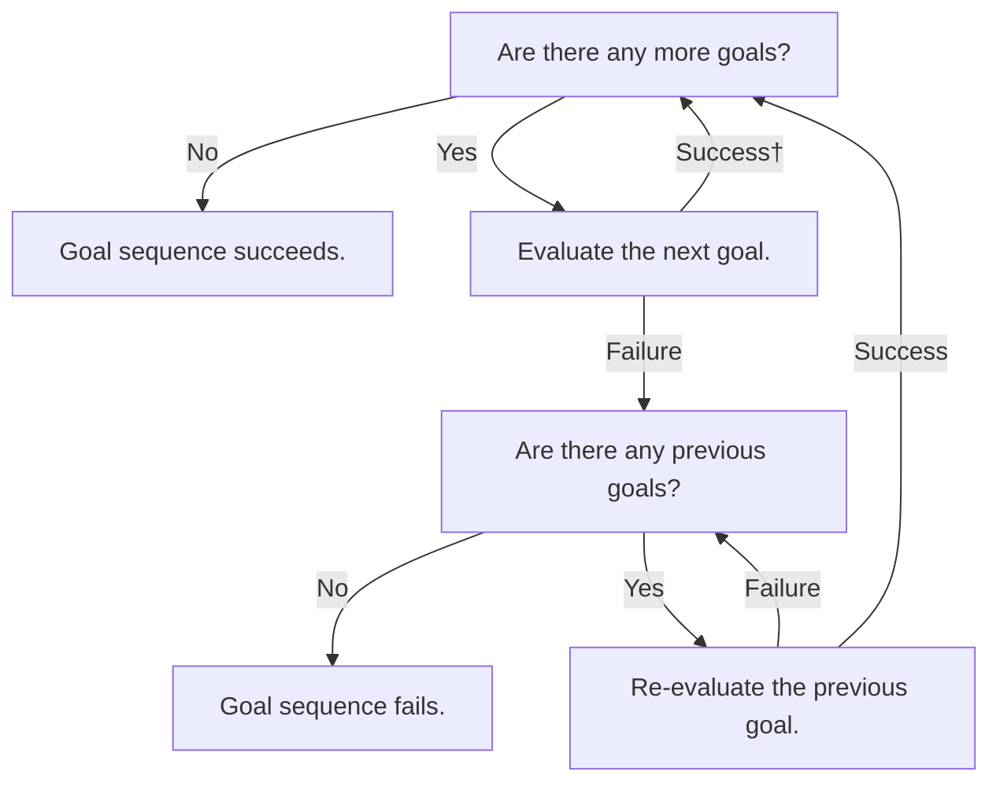
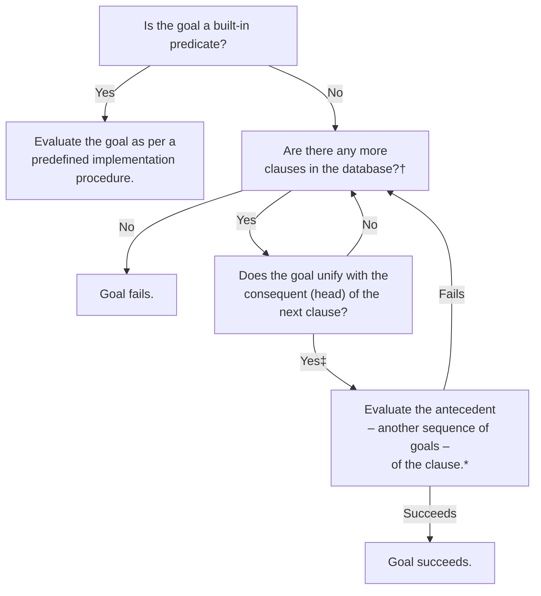

# Iprollogical

A collection of notes concerning and exercises reflecting my understanding of logic and answer-set programming paradigms, started as part of my course in Intelligent Decision Making. My intention is to continue expanding this knowledge base in accordance with to the benefit of my own.

## Prolog Evaluation Procedures (Unification & Backtracking)

Charts that visualise the precedural flow of a Prolog program. Appropriated from the second edition of Bramer's *Logic Programming with Prolog* (2013), Figures 3.5 and 3.6. Given the processes outlined below, it stands to reason that both the order in which the clauses concerning a certain predicate and the order of goals in the antecedent of a rule exercise significant influence on the evaluation of any given query; a truly **declarative** program should do what it can to mitigate the effect of these circumstances, refraining from relying on them to communicate the semantics or influence the execution process for any instance of that program.

### Evaluating a Sequence of Goals

† Some variables may have been instantiated (or bound) as part of this step. 
‡ Some variables may be reinstantiated – uninstantiated (or unbound) and reinstantiated to a new term – here.

### Evaluating & Re-evaluating a Goal

† First evaluation begins at the top of the database; re-evaluation begins after the clause that last satisfied the goal. 
‡ Some variables may have been instantiated (or bound) as part of this step. 
\* Clause succeeds immediately if it is a fact (a rule where the antecedent is always true).